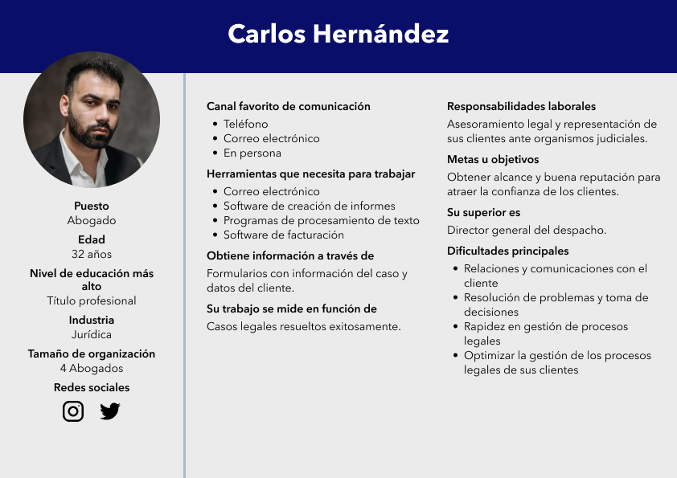
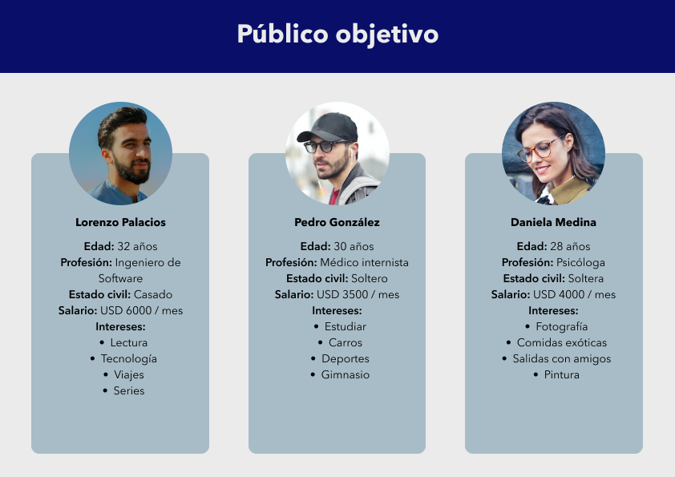
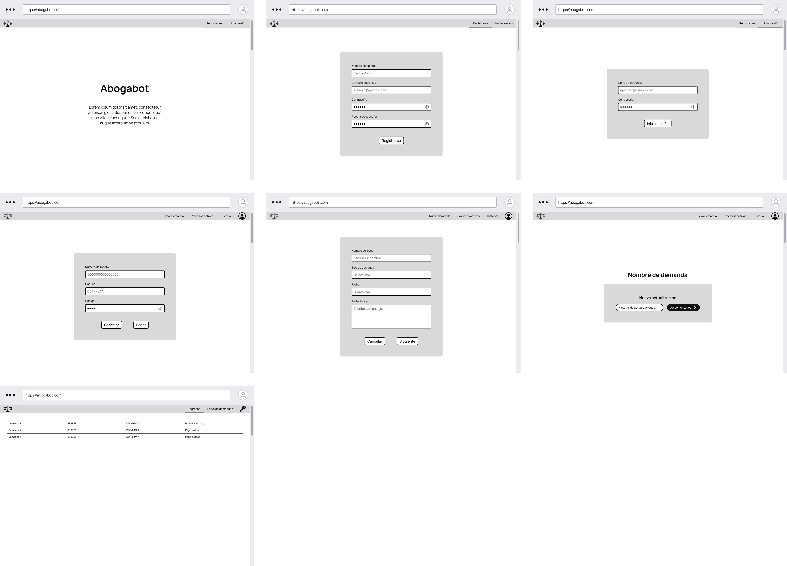

# Práctica 1 - Abogabot

## 1. Toma de requerimientos

***Usuario solicitante***

Se solicita una página que automatice las demandas de los clientes a través del llenado de un formulario y posterior pago para finalizar la transacción. El cliente crea una cuenta en la página para dar seguimiento a su proceso legal y le llegan notificaciones vía correo electrónico avisándole cada vez que se actualice su demanda.

El administrador recibe una notificación de una nueva demanda y con los datos del formulario se crea automáticamente un documento legal en word.

Al recibir el pago, el administrador debe ser capaz de visualizarlo en un dashboard que muestre la cantidad de ingresos recibidos. También actualiza el proceso de demanda y agrega comentarios en cada parte del proceso.

La página debe ser visualizada correctamente desde el celular y la preferencia de colores es azul marino y blanco, se aceptan propuestas.

***Líder funcional***

El cliente requiere de una aplicación web que le permita automatizar las demandas de sus usuarios. Esto se realizará de la siguiente manera:

- Usuario: Deberá validar su identidad con una cuenta, luego podrá llenar un formulario con los datos de su demanda y una vez lleno será enviado al proceso de pago para culminar la transacción. De ser exitoso el pago, se creará automáticamente un documento legal en formato `.DOC` con los datos del formulario llenado anteriormente. El usuario tendrá acceso a un dashboard con su proceso legal actualizado donde podrá leer comentarios dejados por el administrador en cada actualización nueva, también se le enviarán notificaciones automáticas por correo electrónico cada vez que se actualice su demanda.
- Administrador: Recibe una notificación de un nuevo caso y podrá visualizar el pago del mismo en un dashboard que muestra los ingresos recibidos. Podrá actualizar las demandas de sus clientes y agregar comentarios en cada actualización que haga.

Se requiere que la página web sea responsive y se seleccionaron los colores azul marino y blanco pero el cliente acepta recomendaciones.

***Requerimientos funcionales***

- Los usuarios deben ingresar al sistema con un correo y contraseña.
- Solo se permitirá el pago al llenar por completo el formulario.
- El sistema notificará al administrador cuando registre una nueva demanda.
- El sistema creará un documento `.DOC` con los datos del formulario cuando detecte un pago exitoso.
- Creación de dashboard de administrador que reflejará los ingresos generados y le permitirá administrar los casos de sus clientes actualizándolos y agregando comentarios.
- Creación de dashboard de usuario que reflejará las actualizaciones y comentarios enviados por el administrador.
- El sistema notificará al usuario vía correo electrónico cada vez que se actualice su proceso.
- La aplicación debe poder utilizarse sin necesidad de instalar ningún software adicional además de un navegador web.

***Requerimientos no funcionales***

- La aplicación web debe poseer un diseño responsive a fin de su correcta visualización en dispositivos móviles.
- La paleta de colores contiene azul marino y blanco.

## 1.1 Diagrama de flujo

## 2. Buyer persona

## 3. Público objetivo

## 4. Wireframe

## 5. Diseño UI

